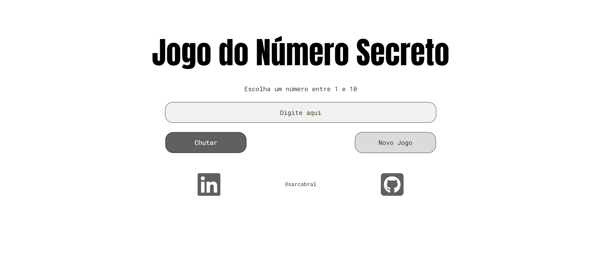

<h1 align="center">Jogo do Número Secreto</h1>

  <strong>🎮 Um jogo para desafiar sua sorte e capacidade de acertar o número na menor quantidade de tentativas possível 🕹️</strong>

  
Divirta-se 😄

    <a href="#-visão-do-projeto">Visão do projeto</a> •
    <a href="#-layout">Layout</a> • 
    <a href="#-tecnologias">Tecnologias</a> •
    <a href="#-instruções">Instruções</a> •
    <a href="#-autora">Autora</a>
 

## 🔭 Visão do projeto

O projeto foi desenvolvido com base nos cursos de Lógica de Programação da Alura como prática mediante os assuntos trabalhados durante a formação Iniciante em Programação da Oracle Next Education. A lógica, feita em JavaScript, desafia os jogadores a adivinharem o número sorteado pelo computador, dando dicas durante as tentativas até acertar. Ao final você poderá ver quantas tentativas foram necessárias para chegar a esse número secreto. Aproveite!

## 🎨 Layout
O design foi feito no [figma](https://www.figma.com/design/gaaLd9X0k3NX2h9z4EFHAb/Jogo-do-N%C3%BAmero-Secreto?node-id=0-1&t=In6vUYQCk7tVvhEg-1), confira para saber mais detalhes da página.

## 💻 Tecnologias

## ⚙️ Instruções

Você pode acessar o link do projeto [aqui](https://jogo-numero-secreto-drab-xi.vercel.app/)

- Ao iniciar a página, um pop-up irá parecer abaixo perguntando se deseja narração de voz. Pressione Allow para ativar ou Deny para desativar.
- O número secreto está entre 1 e 10, então escolha um número nessa faixa para acertar o mais rápido possível.

## 🧙‍♂️ Autora

